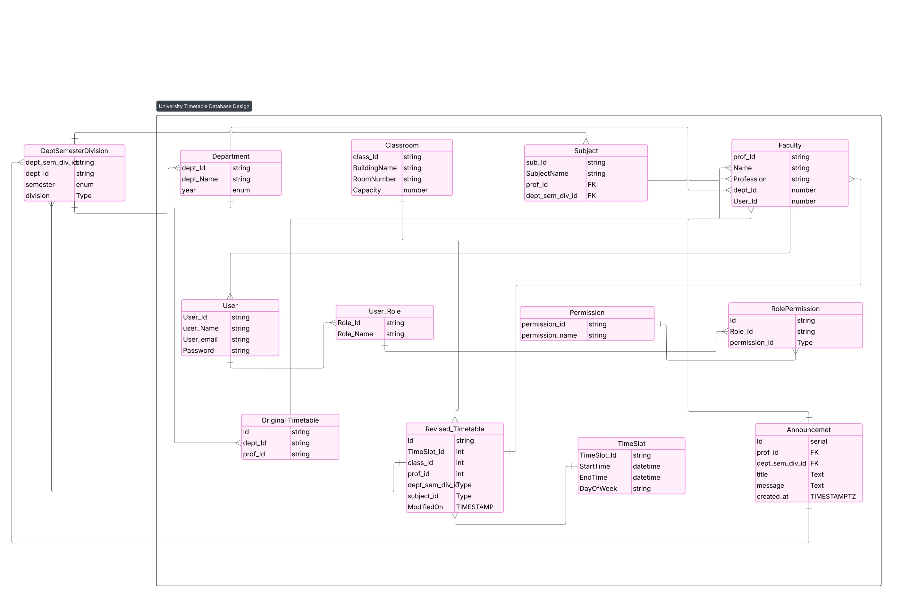

# 🗓️ Timetable Management System (Backend + Frontend)

A smart and automated **Timetable Management System** for engineering colleges, built using **FastAPI** for backend, **React** for frontend, and **PostgreSQL** for managing complex scheduling data.

---

## 🎯 Purpose

In most engineering colleges, preparing a timetable is a **time-consuming and error-prone** process.

Common issues include:
- Teachers being double-booked
- Classroom overlaps
- Unbalanced workloads
- Inefficient resource utilization

> 🎯 Our system aims to **automate and optimize** the timetable generation process using a smart algorithm and AI-powered suggestions.

---

## 💡 Key Features

### 🔧 Backend (FastAPI)
- Teacher, Department, Subject, and Classroom management
- Conflict detection & auto-suggestions
- Real-time alerts for leave, conflicts, and schedule changes
- Downloadable PDF timetables
- Teacher and room utilization reports
- Admin dashboard APIs
- Secure role-based access (Admin, Faculty)

### 💻 Frontend (React)
- Clean, user-friendly dashboard for Admin and Faculty
- Drag-and-drop timetable editor
- Real-time views of schedule
- PDF preview and download
- Report and analytics views
- Notifications and alerts interface

---

## 🧱 Tech Stack

| Layer       | Technology           |
|-------------|----------------------|
| Frontend    | **Svelt**,  
| Backend     | **FastAPI** (Python) |
| Database    | **PostgreSQL** (Recommended) |
| Containerization | **Docker**, Docker Compose |
| Scheduling Logic | Custom Python logic
| PDF Reports | **ReportLab** |
| Deployment  |  Render / VPS with Docker |

## Database Design Link

https://lucid.app/lucidchart/58446467-6884-4005-a6b8-872b6a062e01/edit?viewport_loc=-1079%2C-454%2C3561%2C1327%2C0_0&invitationId=inv_9f8ddd78-eeca-4e1b-9255-cff3a49316b0

##  ⚙️Project architecture section

##  🛠️ Command to Copy .env.example to .env

#### Copy the example environment file and rename it to .env:

✅ For Linux / macOS / Git Bash:
    cp .env.example .env

✅ For Windows (Command Prompt):
    copy .env.example .env

✅ For Windows (PowerShell):
    Copy-Item .env.example .env

Then, open the .env file and replace the dummy values with actual credentials 

